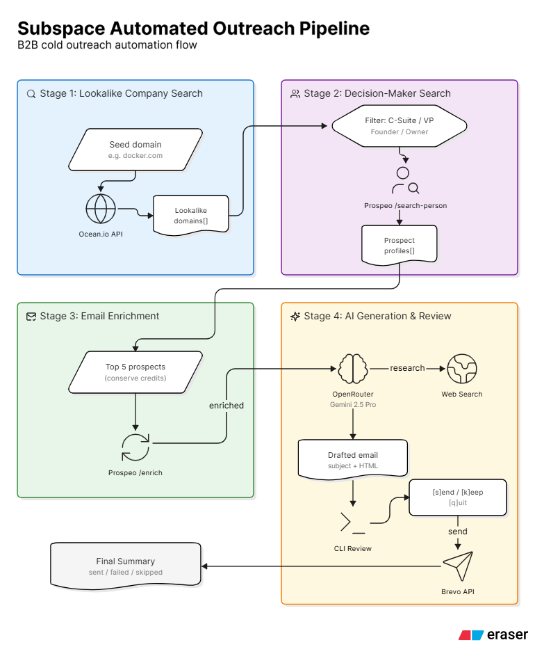
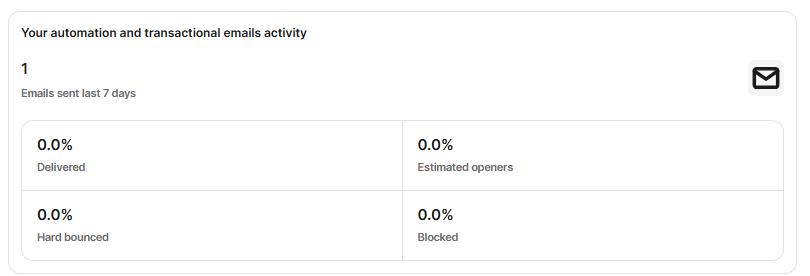

# 📧 Automated Cold Outreach Pipeline

An end-to-end automated pipeline that discovers companies similar to a target domain, finds their decision-makers, generates hyper-personalized cold emails using AI with live web research, and sends them — all from a single terminal command.

## System Design



## How It Works

The pipeline runs through **4 stages** sequentially:

| Stage | What It Does | API Used |
|-------|-------------|----------|
| **1. Company Discovery** | Finds lookalike companies from a seed domain | Ocean.io |
| **2. People Search** | Discovers C-Suite, VPs, and Founders at those companies | Prospeo |
| **3. Email Enrichment** | Resolves verified work email addresses for each person | Prospeo |
| **4. AI Email Generation** | Generates a personalized cold email using web search context, then prompts you to send/skip/quit | OpenRouter (Gemini 2.5 Pro + Web Search) → Brevo |

## Terminal Logs

```bash
$ node server.js internshala.com 1

🚀 Starting Automated Outreach Pipeline for seed domain: internshala.com
--- STAGE 1: Finding lookalike companies ---
Sending lookalike search request to Ocean.io for seed domain: internshala.com
Found 1 lookalike domains: shine.com
--- STAGE 2: Searching for decision-makers ---
Sending search-person request to Prospeo for websites: ["shine.com"]
Found 2 decision-makers.
--- STAGE 3: Enriching profiles with work emails ---
[1/1] Enriching Akhil Gupta...
--- STAGE 4: Launching interactive email review ---

==================================================
📧 EMAIL OUTREACH PREVIEW
Recipient : Akhil Gupta (akhil.gupta@hindustantimes.com)
Company   : Shine.com
Designation: Chief Executive Officer
Subject   : Beyond the Job Search: A student's perspective on Shine's mission
--------------------------------------------------
body {
      font-family: Arial, sans-serif;
      line-height: 1.6;
      color: #333333;
    }
    a {
      color: #0073b1;
      text-decoration: none;
    }
    a:hover {
      text-decoration: underline;
    }


  Dear Mr. Gupta,


    I'm writing to you today as someone deeply impressed by Shine.com's evolution under your leadership. While most portals stop at the job match, your focus on a candidate's "entire career growth" is a powerful differentiator. Witnessing the development of initiatives like Shine Learning confirms a genuine commitment to redefining how talent meets opportunity in India [shine.com].


    As a third-year B.Tech student, I'm particularly fascinated by the "advanced 2-way matching technology" that powers your platform. My coursework has ignited a passion for creating intelligent, user-centric systems, and I am eager to apply my understanding of algorithms and software development to a product that directly impacts millions of professional journeys. I believe my enthusiasm and fresh technical perspective could be a valuable asset to your team as you continue to innovate.


    I know your time is incredibly valuable. Would you be open to a brief 15-minute conversation to discuss how a proactive student could contribute to Shine.com's mission, perhaps through a future internship or project?


    My resume, which provides more detail on my technical background, can be accessed here: Utsav Jana - Resume.


  Thank you for your time and for building a platform that truly invests in people's futures.


  Sincerely,


    Utsav Jana

    3rd Year B.Tech Student
==================================================
Action: [s]end / [k]eep/skip / [q]uit batch: s
Sending transactional email via Brevo to: akhil.gupta@hindustantimes.com (Akhil Gupta)

🎉 Pipeline completed. Sent: 1, Failed: 0, Skipped: 0

📊 Final Results: {
  "total": 1,
  "sent": 1,
  "failed": 0,
  "skipped": 0
}
```

## Email Preview



## Setup

### 1. Clone & Install

```bash
git clone https://github.com/SOGeKING-NUL/Subspace--Automated-Outreach-Pipeline.git
cd Subspace--Automated-Outreach-Pipeline
npm install
```

### 2. Configure Environment

Create a `.env` file in the project root:

```env
PORT=3000

PROSPEO_API=your_prospeo_api_key
OCEAN_API=your_ocean_api_key
BREVO_API=your_brevo_api_key

BREVO_SENDER_EMAIL=your_verified_email@gmail.com
BREVO_SENDER_NAME=Your Name
RESUME_DRIVE_LINK=https://drive.google.com/your-resume-link

OPENROUTER_API=your_openrouter_api_key
```

### 3. Verify Brevo Sender

Log into your [Brevo Dashboard](https://app.brevo.com/) and verify `BREVO_SENDER_EMAIL` as a sender so transactional emails can be dispatched from your address.

## Usage

### CLI Mode (Recommended)

Run the full pipeline with a single command:

```bash
node server.js docker.com
```

With a custom company limit:

```bash
node server.js docker.com 5
```

Or via npm:

```bash
npm run pipeline -- docker.com
```

### Server Mode

Start the Express API (for programmatic/REST access):

```bash
npm run dev
```

Then trigger the pipeline via HTTP:

```bash
curl -X POST http://localhost:3000/api/pipeline/run \
  -H "Content-Type: application/json" \
  -d '{"domain": "docker.com", "limit": 5}'
```

## Project Structure

```
├── server.js                  # Entry point (CLI + Express server)
├── routes/
│   ├── pipelineRoutes.js      # Core pipeline logic + Express route
│   ├── companyRoutes.js       # Company search API route
│   ├── peopleRoutes.js        # People search & enrich API route
│   └── mailRoutes.js          # Standalone mail send API route
├── services/
│   ├── oceanService.js        # Ocean.io lookalike company search
│   ├── prospeoService.js      # Prospeo person search & enrichment
│   ├── brevoService.js        # OpenRouter email generation + Brevo sending
│   ├── terminalReview.js      # Interactive terminal email review
│   └── eazyreachService.js    # Legacy email enrichment (not active)
├── SYSTEM_DESIGN.md           # Architecture & flowchart (Mermaid)
├── .env                       # API keys (not committed)
└── package.json
```

## Tech Stack

- **Node.js** (ES Modules)
- **Express.js** — REST API server
- **Ocean.io API** — Lookalike company discovery
- **Prospeo API** — Person search & email enrichment
- **OpenRouter API** — LLM email generation (Gemini 2.5 Pro + Web Search)
- **Brevo API** — Transactional email delivery

## License

ISC
