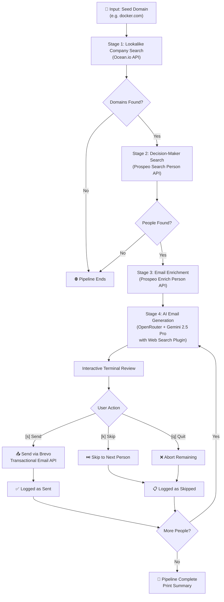

# System Design — Automated Outreach Pipeline

## Overview

This pipeline automates cold outreach by chaining four stages together: company discovery, people search, email enrichment, and AI-powered email generation with interactive review.

## Architecture Flowchart



## Component Descriptions

### Entry Point (`server.js`)
- **CLI Mode**: `node server.js <domain> [limit]` — runs the pipeline directly and exits.
- **Server Mode**: `node server.js` (no args) — starts an Express API on port 3000.

### Stage 1 — Lookalike Company Search (`services/oceanService.js`)
- Calls the **Ocean.io** `/v3/search/companies` endpoint.
- Input: a seed domain (e.g. `docker.com`).
- Filters: Indian companies, configurable result limit.
- Output: array of lookalike company domains.

### Stage 2 — Decision-Maker Search (`services/prospeoService.js` → `searchDecisionMakers`)
- Calls the **Prospeo** `/search-person` endpoint.
- Filters for C-Suite, VP, and Founder/Owner seniority levels.
- Output: array of people with name, designation, company, LinkedIn URL, and person_id.

### Stage 3 — Email Enrichment (`services/prospeoService.js` → `bulkEnrichPeople`)
- Calls the **Prospeo** `/enrich-person` endpoint sequentially (one per person).
- Includes retry logic with exponential backoff on HTTP 429 rate limits.
- 1-second delay between requests to respect free-tier limits.
- Output: same people array, now enriched with verified work email addresses.

### Stage 4 — AI Email Generation & Review (`services/brevoService.js` + `services/terminalReview.js`)
- Calls **OpenRouter** (`google/gemini-2.5-pro` with the `web` plugin) to generate a personalized cold outreach email.
- The LLM performs a live web search on each prospect's company before drafting.
- Emails are presented in the terminal for interactive review: **[s]end / [k]ip / [q]uit**.
- Approved emails are dispatched through **Brevo's** transactional email API.

### Data Flow

```
Seed Domain
    │
    ▼
┌─────────────┐     ┌──────────────────┐     ┌─────────────────┐
│  Ocean.io   │────▶│  Prospeo Search  │────▶│ Prospeo Enrich  │
│  (domains)  │     │  (people)        │     │ (emails)        │
└─────────────┘     └──────────────────┘     └─────────────────┘
                                                      │
                                                      ▼
                                             ┌─────────────────┐
                                             │  OpenRouter LLM │
                                             │  (web search +  │
                                             │   email draft)  │
                                             └────────┬────────┘
                                                      │
                                                      ▼
                                             ┌─────────────────┐
                                             │ Terminal Review  │
                                             │ [s]end/[k]ip/   │
                                             │ [q]uit          │
                                             └────────┬────────┘
                                                      │
                                                      ▼
                                             ┌─────────────────┐
                                             │   Brevo SMTP    │
                                             │   (send email)  │
                                             └─────────────────┘
```
